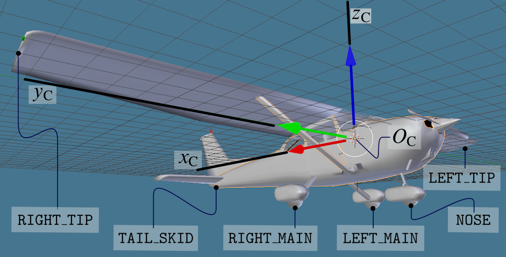
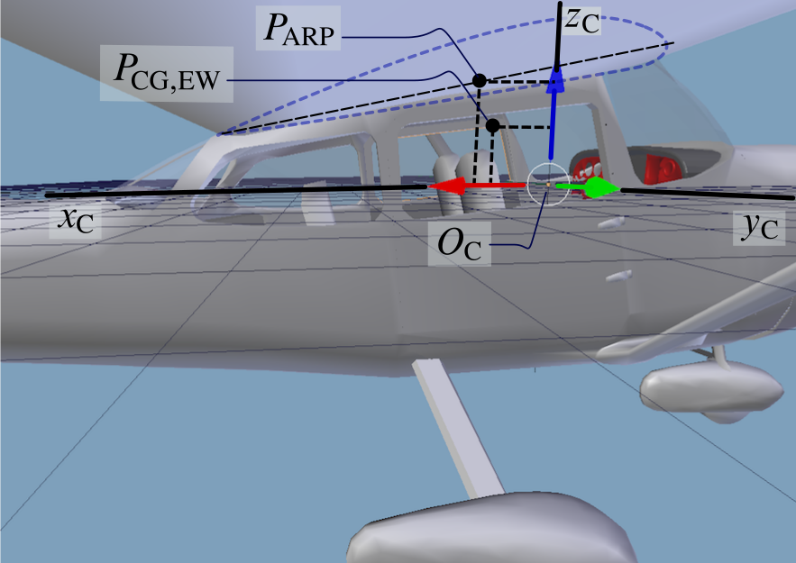
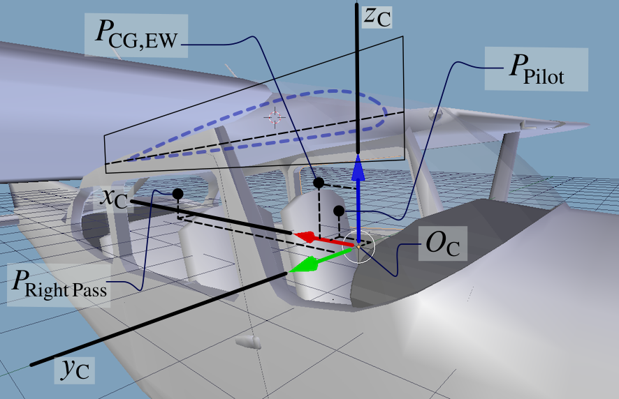

Frames of reference
===================

Before moving into a description of the configuration file syntax, one must understand
some basic information about the frames of reference used:

* to describe locations of objects on the aircraft,
* to specify conditions related to aircraft position and orientation in space,
* to assign inputs for a given flight condition.

Reference sources:
- `JSBSim Reference Manual - Frames of reference <https://jsbsim-team.github.io/jsbsim-reference-manual/user/concepts/frames-of-reference/index.html>`_
- `Wikipedia about axes conventions <https://en.wikipedia.org/wiki/Axes_conventions>`_

Structural, or "Construction" Frame
------------------------------------

This frame is the manufacturer-style reference used to define points on the aircraft:
center of gravity, landing gear contact points, pilot eye-point, point masses, thrusters,
and more. In JSBSim aircraft configuration files, many locations are specified in this
frame.

In the structural frame, the X-axis runs along fuselage length and points toward the
tail, the Y-axis points toward the right wing, and Z is positive upward. A common origin
:math:`O_\mathrm{C}` is near the front of the aircraft. This frame is often denoted as
:math:`\mathcal{F}_\mathrm{C} = \{O_\mathrm{C}, x_\mathrm{C}, y_\mathrm{C}, z_\mathrm{C}\}`.

.. figure:: ../../docs/_static/concepts/frames-of-reference/ac_construction_axes.svg
   :width: 90%
   :align: center
   :alt: Aircraft construction frame

   Aircraft structural (construction) frame of reference.

The :math:`x_\mathrm{C}` axis is often aligned with the fuselage centerline and frequently
with thrust axis. Positions along the axes are commonly called stations
(:math:`x_\mathrm{C}`), buttlines (:math:`y_\mathrm{C}`), and waterlines
(:math:`z_\mathrm{C}`).

.. image:: ../../docs/_static/concepts/frames-of-reference/c172x_blender.png
   :width: 70%
   :align: center
   :alt: C172 structural frame in Blender

JSBSim mainly uses relative distances between points, so the absolute origin location is
not critical if geometry is consistent.

.. image:: ../../docs/_static/concepts/frames-of-reference/ac_center_of_gravity.svg
   :width: 90%
   :align: center
   :alt: Center of gravity in construction frame

Body Frame
----------

In JSBSim, the body frame is equivalent to a 180-degree rotation of the construction
frame around :math:`y_\mathrm{C}`, with origin at the center of mass :math:`G`. The body
frame is often written as
:math:`\mathcal{F}_\mathrm{B} = \{G, x_\mathrm{B}, y_\mathrm{B}, z_\mathrm{B}\}`.

* :math:`x_\mathrm{B}` points forward (roll axis),
* :math:`y_\mathrm{B}` points to the right wing (pitch axis),
* :math:`z_\mathrm{B}` points downward (yaw axis direction convention in body coordinates).

.. image:: ../../docs/_static/concepts/frames-of-reference/ac_body_axes.svg
   :width: 90%
   :align: center
   :alt: Body frame axes

Forces and moments are summed in body axes and integrated to obtain translational and
rotational states.

Stability, or "Aerodynamic" Frame
----------------------------------

This frame is defined by the relative wind orientation with respect to the aircraft.
Denote it as :math:`\mathcal{F}_\mathrm{A} = \{ G, x_\mathrm{A}, y_\mathrm{A}, z_\mathrm{A} \}`.

* :math:`x_\mathrm{A}` points into the relative wind projected onto the symmetry plane,
* :math:`y_\mathrm{A}` coincides with :math:`y_\mathrm{B}`,
* :math:`z_\mathrm{A}` completes the right-handed triad.

The aerodynamic angles are angle of attack :math:`\alpha_\mathrm{B}` and sideslip
:math:`\beta`.

.. image:: ../../docs/_static/concepts/frames-of-reference/ac_aero_axes.svg
   :width: 90%
   :align: center
   :alt: Aerodynamic frame and aerodynamic angles

In JSBSim usage, the term stability frame commonly refers to this aerodynamic frame.
Lift is aligned with :math:`-z_\mathrm{A}` and drag with the opposite wind direction.

.. image:: ../../docs/_static/concepts/frames-of-reference/three_d_forces_level_turn.svg
   :width: 90%
   :align: center
   :alt: Banked lift in coordinated turn

Earth-Centered Frames (ECI and ECEF)
------------------------------------

The Earth-Centered Inertial frame is
:math:`\mathcal{F}_\mathrm{ECI} = \{ O_\mathrm{ECI}, x_\mathrm{ECI}, y_\mathrm{ECI}, z_\mathrm{ECI} \}`.
Its axes are fixed relative to inertial space.

The Earth-Centered Earth-Fixed frame is
:math:`\mathcal{F}_\mathrm{ECEF} = \{ O_\mathrm{ECEF}, x_\mathrm{ECEF}, y_\mathrm{ECEF}, z_\mathrm{ECEF} \}`.
Its axes rotate with Earth, with angular rate :math:`\omega_\mathrm{E}`.

.. image:: ../../docs/_static/concepts/frames-of-reference/inertial_frame.svg
   :width: 60%
   :align: center
   :alt: ECI and ECEF frames

North-Oriented Tangent Frame
----------------------------

A local tangent frame can be defined at a point :math:`O_\mathrm{E}` on Earth's surface:
:math:`\mathcal{F}_\mathrm{E} = \{ O_\mathrm{E}, x_\mathrm{E}, y_\mathrm{E}, z_\mathrm{E} \}`.
Here :math:`x_\mathrm{E}` points North, :math:`y_\mathrm{E}` points East,
and :math:`z_\mathrm{E}` points Down (NED convention).

.. image:: ../../docs/_static/concepts/frames-of-reference/earth_frames.svg
   :width: 60%
   :align: center
   :alt: ECEF and local tangent frames

Local-Vertical Local-Level Frame (Local NED)
---------------------------------------------

The local vertical frame is
:math:`\mathcal{F}_\mathrm{V} = \{ G, x_\mathrm{V}, y_\mathrm{V}, z_\mathrm{V} \}`.
It depends on aircraft position over Earth, not on body attitude.

In this frame, weight has components :math:`(0, 0, mg)`.
The aircraft Euler angles :math:`\psi`, :math:`\theta`, :math:`\phi`
(3-2-1 sequence) define body orientation with respect to local NED.

.. image:: ../../docs/_static/concepts/frames-of-reference/ac_local_vertical_axes.svg
   :width: 90%
   :align: center
   :alt: Body and local NED frames

.. image:: ../../docs/_static/concepts/frames-of-reference/ac_euler_gimbal.svg
   :width: 60%
   :align: center
   :alt: Aircraft Euler angle sequence

Wind Frame
----------

The wind frame :math:`\mathcal{F}_\mathrm{W} = \{ G, x_\mathrm{W}, y_\mathrm{W}, z_\mathrm{W} \}`
uses:

* :math:`x_\mathrm{W}` along velocity direction,
* :math:`z_\mathrm{W}` along lift line (equal to :math:`z_\mathrm{A}`),
* :math:`y_\mathrm{W}` completing the right-handed frame.

Drag and lift in wind axes satisfy :math:`X_\mathrm{W} = -D` and :math:`Z_\mathrm{W} = -L`.
When :math:`\beta = 0`, wind and aerodynamic frames coincide.

.. image:: ../../docs/_static/concepts/frames-of-reference/three_d_definitions.svg
   :width: 90%
   :align: center
   :alt: Standard flight mechanics reference frames

The relation among wind, aerodynamic, and body frames is:

.. math::

   \mathcal{F}_\mathrm{W}
   \xrightarrow{-\beta\ \text{around}\ z_\mathrm{W}}
   \mathcal{F}_\mathrm{A}
   \xrightarrow{\alpha_\mathrm{B}\ \text{around}\ y_\mathrm{A}}
   \mathcal{F}_\mathrm{B}

Using drag, side force and lift, body-axis components are written as:

.. math::

   \begin{bmatrix} X_\mathrm{B} \\ Y_\mathrm{B} \\ Z_\mathrm{B} \end{bmatrix}
   =
   \begin{bmatrix}
     \cos\alpha_\mathrm{B} & 0 & -\sin\alpha_\mathrm{B} \\
     0 & 1 & 0 \\
     \sin\alpha_\mathrm{B} & 0 & \cos\alpha_\mathrm{B}
   \end{bmatrix}
   \begin{bmatrix}
     \cos\beta & -\sin\beta & 0 \\
     \sin\beta & \cos\beta & 0 \\
     0 & 0 & 1
   \end{bmatrix}
   \begin{bmatrix} -D \\ Y_\mathrm{W} \\ -L \end{bmatrix}
